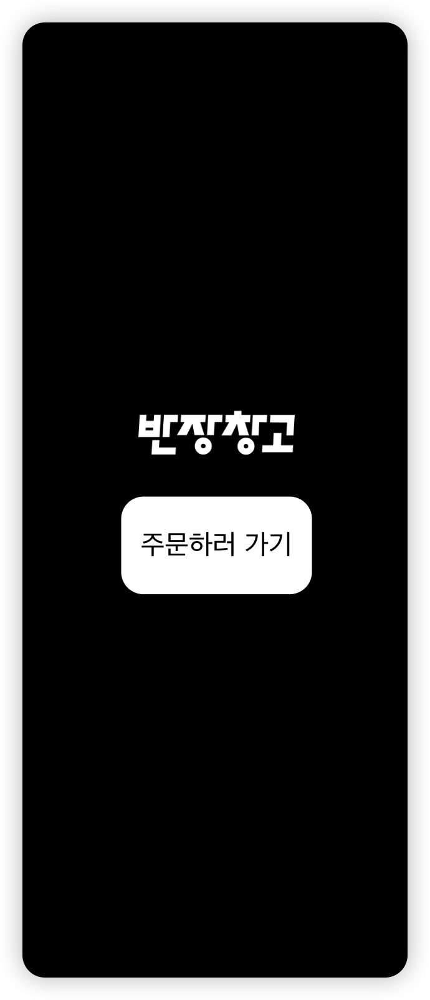

# 두번째 과제 - 반장창고

안녕하세요! 이번 두번째의 기업 과제를 진행했습니다. 열심히 만들었으니 잘 부탁 드립니다 😃


## Stack
<p align="left">
	
	
 	
	
</p>


## 실행 커맨드

```bash
# Node.js version >= v18.17.0 is required

yarn dev
# 기본 서버 실행
yarn server
# 무한 스크롤 테스트용 서버 실행
yarn server-test
```

실제로 사용되는 데이터는 더 많을 것이라 생각해서 데이터가 더 많은, `db.test.json` 파일을 만들고 해당 파일로 서버를 실행하는 커맨드를 추가했습니다.

## Detail

### Atomic Design Pattern


컴포넌트의 재사용성과 유지보수를 고려해 아토믹 디자인 패턴으로 설계했습니다.<br>

### Pages
<p align="left">
	
	
	
	
	
	
</p>

### Feature
<p align="left">


</p>

사용자가 실수로 잘못 클릭해서 주문 페이지를 이탈하는 상황을 방지하기위해, `Confirm Modal`을 추가했습니다. 추가로, 주문중인 상태에서 새로고침시에도 한번 더 확인하도록 구현했습니다.

#### 컨펌 모달 전략

기본적으로 `useRouteControl` 훅을 사용하는 path에서 다른 페이지로 routing 시도할 경우에 띄워집니다.

- 모달 생성 시나리오

  - `/order` 페이지에서 한 가지 품목이라도 수량을 추가했을 경우<br>(수량을 추가하고 직접`/complete` 또는 `/error`로 접근 시에도 해당)

- 모달 방지 시나리오
  - `/order` 페이지에서 총 수량이 `0` 일 경우
  - 사용자가 `/complete`, `/error`로 직접 타이핑해서 라우팅하는 경우
  - `주문하기` 버튼을 클릭해서 api 요청을 시도하는 경우

#### ErrorBoundary


컴포넌트 가장 바깥에 둔 `GlobalErrorBoundary` 와 각 api 요청에 대한 책임만 가지는 Fetcher 컴포넌트를 감싸는 `ApiErrorBoundary`를 두어 에러를 핸들링함으로써 앱의 안정성을 높혔습니다.

#### 수량 카운터 전략


사용자는 `+`, `-` 버튼을 클릭해서 카운트하는 것 뿐만아니라, 클릭해서 직접 수량을 변경할 수 있습니다.<br> `0 ~ 999` 사이의 값만 허용합니다.


리스트에서 변경한 아이템의 `총 수량`과 `총 가격`이 표시됩니다.

## 추가 설명

`/complete` , `/error` 페이지를 보기위해서 직접 타이핑 접근해도 되고,
`/src/components/organisms/OrderModal.tsx`에 구현된 `useSubmitOrderError()`의 주석을 풀고 사용해도 됩니다.

```jsx
function OrderModal() {
	const isSelected = useSetRecoilState(orderSelectedState);
	const orderList = useRecoilValue(orderListState);
	// Complete용 query
	const { data, mutateAsync, isPending } = useSubmitOrderComplete();
	// Error용 query
	// const { data, mutateAsync, isPending } = useSubmitOrderError();
  ...
}
```

감사합니다! 😃
